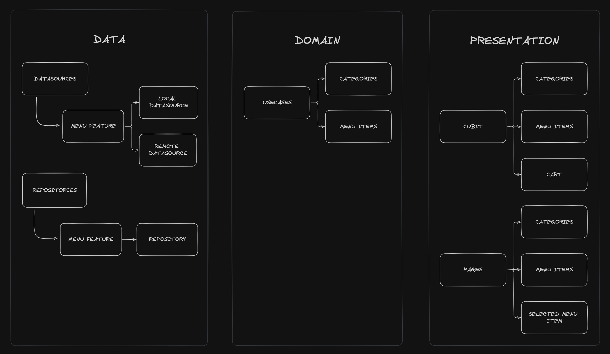
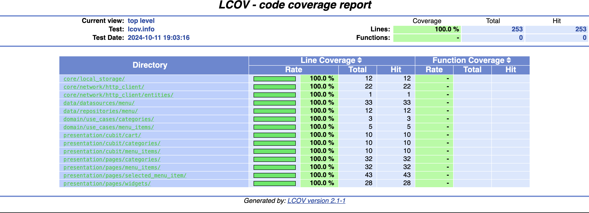

# Wendy's Menu App

This Flutter application is designed to simulate a shopping experience for Wendy's menu items. The app fetches menu data from an external endpoint and displays it in three different screens: Categories, Menu Items, and Selected Menu Item. Users can add items to their cart and navigate through the menu.

## 1. Test Requirements

The challenge involves creating a mobile app with the following features:

- **Categories Screen**: Displays a list of menu categories.
- **Menu Items Screen**: Shows items under a selected category.
- **Selected Menu Item Screen**: Displays details of a selected menu item and allows adding it to the cart.

The app must send HTTP requests to the `getSiteMenu` endpoint to fetch menu data. Data from the endpoint should be parsed, and only relevant information should be displayed. Additional features include caching and test coverage, as mentioned in the challenge details.

## 2. App Result

Here are some key results of the application:


## 3. Architecture

The app follows a clean architecture structure, ensuring separation of concerns and modularity:

- **Data Layer**: Handles the data sources, including HTTP requests to the Wendy’s API and data caching mechanisms.
- **Domain Layer**: Business logic.
- **Presentation Layer**: Handles the UI components and state management.



## 4. Test Coverage

Unit and widget tests have been implemented to ensure code quality and correctness.

- **Test Coverage Report**: Screenshot of the coverage report generated using `lcov` and `genhtml`.



## 5. How-to Run the App

### Running the App:

1. Generate necessary files using the following command:
   ```bash
   flutter pub run build_runner build --delete-conflicting-outputs
   ```
2. Run the application:
   ```bash
   flutter run
   ```

### Running Tests:

1. Install `lcov` for generating test coverage reports:
   ```bash
   brew install lcov
   ```
2. Run the following script to generate a coverage report:
   ```bash
   ./lcov_script.sh
   ```

## 6. Nice to Have

- **CI Pipeline**: A continuous integration pipeline has been set up using GitHub Actions for automated testing and building.